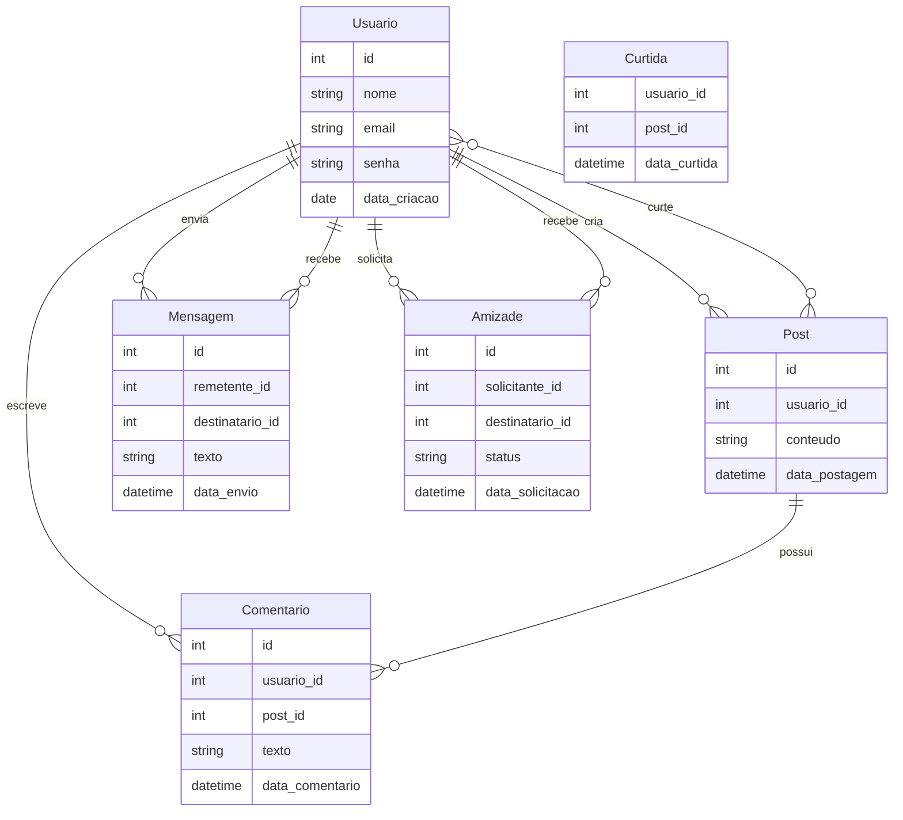
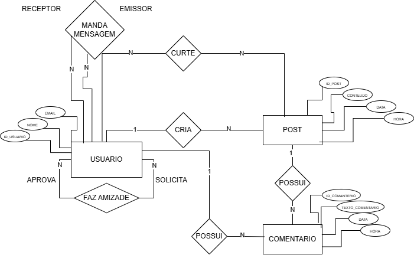

# Mapeamento Sistematico do MER ao Relacional

    Entidade       -> Tabela
    Atributo       -> Coluna
    Identificador  -> Chave Primaria(PK)
    Relacionamento -> Chave Estrangeira (FK) ou Nova Tabela

Todo relacionamento N para N vira uma nova tabela
- 

